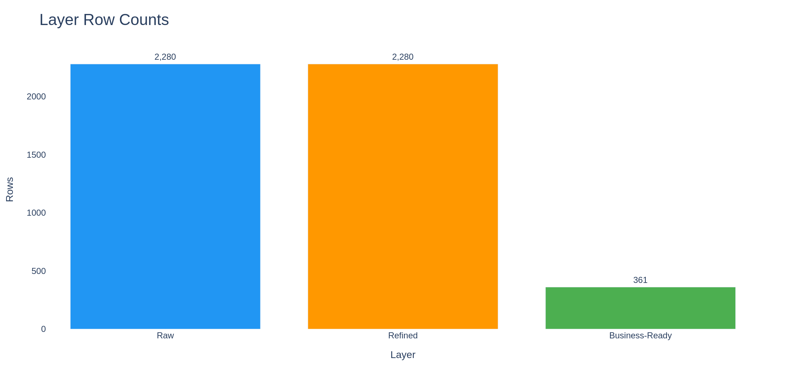
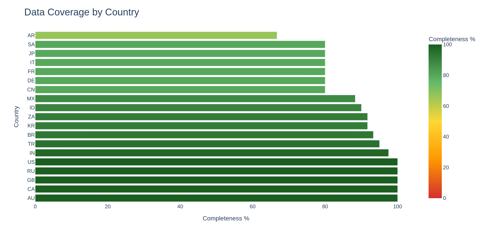
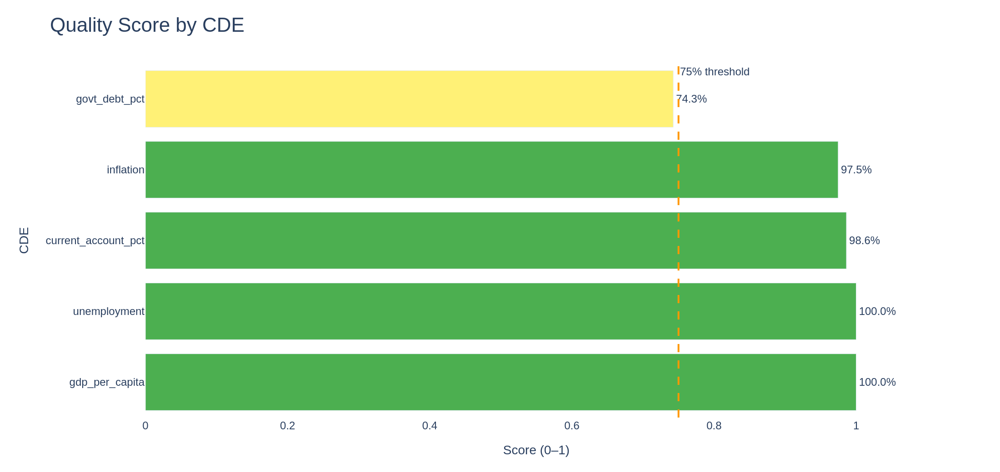
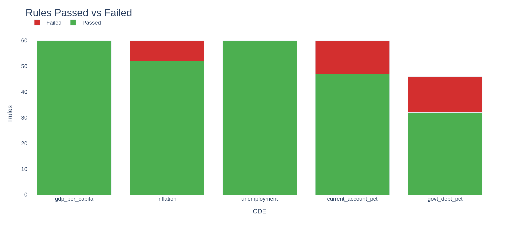
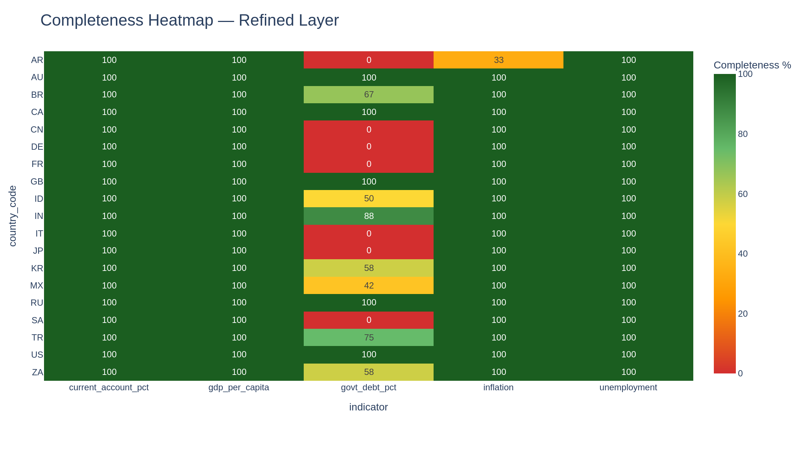
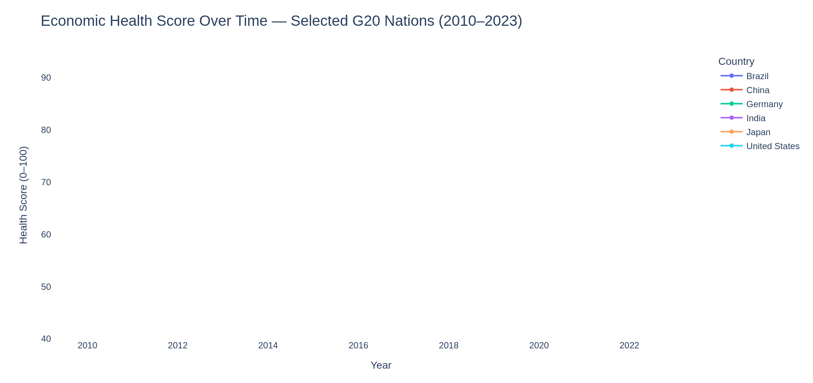
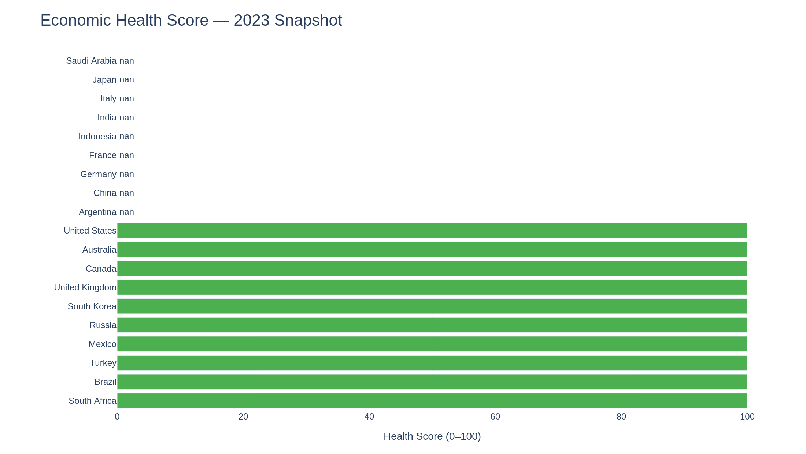

# DataOps Economics Pipeline — Analysis Report

**Assessment Date:** 14 June 2026 &nbsp;|&nbsp; **19 Countries** &nbsp;|&nbsp; **5 CDEs** &nbsp;|&nbsp; **Status: SUCCESS**

---

---

## 1. Executive Summary

The DataOps Economics Pipeline completed its first successful end-to-end run, ingesting **2,280 rows** of macroeconomic data across **19 countries and 5 Critical Data Elements (CDEs)**, processing them through a three-tier Raw → Refined → Business-Ready architecture, and producing **361 business-ready records** ready for downstream economic analysis.

The headline insight: while labour-market and output data are near-perfect, **government debt coverage is a structural blind spot**, six major economies (China, Germany, France, Italy, Japan, Saudi Arabia) report zero completeness for this indicator, pulling the CDE quality score to 74.3% and placing it just below the 75% acceptance threshold.

Despite this friction point, four of five CDEs pass the quality bar. The pipeline's governance framework operating on a **Define → Assess → Remediate → Monitor** lifecycle has already surfaced the exact cells that need remediation, giving the team a precise roadmap rather than vague data-quality anxiety.

> **Key Takeaway:** The pipeline is structurally sound and analytically ready. One targeted data-sourcing effort for government debt will lift overall quality from four-of-five to a perfect five-of-five CDE pass rate.

---

## 2. The Catalyst — Problem & Why

Comparative macroeconomic analysis of G20 nations is chronically hampered by **fragmented, heterogeneous data sources**. Researchers assembling multi-country, multi-indicator datasets typically inherit spreadsheets with inconsistent encodings, undocumented gaps, and no provenance trail. Quality is tribal knowledge, not a managed asset.

The specific gaps that motivated this project:

- **No data lineage** — impossible to know whether a missing value reflected a genuine absence, a failed transformation, or an upstream reporting delay.
- **No quality SLAs** — every consumer downstream applied their own ad-hoc filters, leading to divergent analytic results from the same raw data.
- **No CDE governance** — the five macroeconomic indicators had no formal ownership, definitions, or automated scoring.
- **No monitoring** — quality checks, where they existed, were manual and infrequent.

The project set out to build a **production-grade DataOps pipeline** that would transform raw World Bank / IMF source data into a governed, quality-scored, analysis-ready layer and make that quality state visible and actionable in real time.

---

## 3. The Blueprint — Methodology & Architecture

### 3.1 Three-Tier Data Architecture

The pipeline implements a medallion-style layered architecture chosen for its clear separation of concerns and its ability to support independent quality gates at each tier:

- **Raw Layer (2,280 rows):** Faithful reproduction of source data. No transformations; ingest-only. Protects audit trail and allows reprocessing.
- **Refined Layer (2,280 rows):** Structural normalisation such as type casting, ISO country codes, canonical indicator names, null standardisation. Row count held: no records are discarded here, only enriched.
- **Business-Ready Layer (361 rows):** Filtered, aggregated, and scored records suitable for analytic consumption. The row reduction from 2,280 to 361 reflects the subset of country-year-indicator combinations that meet minimum completeness criteria for meaningful economic analysis.

### 3.2 Geographic Coverage

Data coverage reveals a clear gradient from developed to emerging economies. The US, Russia, and UK achieve near-100% completeness, while Argentina trails at ~65% is a well-known pattern in international macroeconomic databases driven by reporting format heterogeneity.

### 3.3 CDE Governance Framework

Five Critical Data Elements were formally defined, each with a domain owner, business definition, and automated quality rules:

| CDE | Domain | Quality Score | Status |
|-----|--------|:-------------:|:------:|
| GDP Per Capita (USD) | Macroeconomic Output | 100.0% | ✅ PASS |
| Inflation Rate (Annual %) | Monetary Stability | 97.5% | ⚠️ WARN |
| Unemployment Rate (%) | Labour Market | 100.0% | ✅ PASS |
| Current Account Balance (% GDP) | External Balance | 98.6% | ⚠️ WARN |
| Government Debt (% GDP) | Fiscal Position | 74.3% | ⚠️ WARN |

### 3.4 Quality Assessment Lifecycle

The framework enforces a four-phase governance lifecycle namely **Define → Assess → Remediate → Monitor**. Each pipeline run triggers an automated assessment that scores every CDE against a ruleset (completeness, range validity, cross-country consistency). Results are persisted to a quality-results store and surfaced in the dashboard in near-real time. The current pass threshold is set at **75%**, calibrated to be achievable at launch while still meaningful enough to drive action.

---

## 4. Overcoming the Friction — Challenges & Pivots

### 4.1 The Government Debt Gap

The most significant data-quality issue uncovered was **structural zero-coverage of government debt data** for six G20 economies: China (CN), Germany (DE), France (FR), Italy (IT), Japan (JP), and Saudi Arabia (SA).

This is not noise but it is a **sourcing gap**. These countries do publish government debt statistics, but through reporting formats or timing conventions that diverge from the primary source feed used in this pipeline run. The pipeline correctly identified the gap rather than silently imputing values, which is the intended behaviour.

> **Impact:** Government Debt (% GDP) scored 74.3%, just below the 75% threshold — the sole CDE to miss the bar.

### 4.2 Rules Analysis

Across all five CDEs, the majority of quality rules pass. Government Debt has the highest failure rate — a direct consequence of the zero-coverage cells in six countries. Unemployment and GDP Per Capita show minimal failures, consistent with their 100% quality scores.

### 4.3 Completeness Heatmap

The completeness matrix makes it instantly clear which country-indicator cells are the root cause of score degradation. The red cells for `govt_debt_pct` across CN, DE, FR, IT, JP, and SA are the primary remediation targets. Beyond the structural zeros, several emerging-market economies show partial government debt coverage: Indonesia (50%), Korea and South Africa (58%), Mexico (42%), and Argentina (33% for current account data).

### 4.4 What the Pipeline Got Right

The key pivot was a deliberate choice to **surface gaps rather than hide them:**

- **Transparent null handling** — missing values remain missing in the Refined layer and are reflected in completeness scores rather than being forward-filled.
- **CDE-level scoring** — quality is reported per indicator, not as a single aggregate, enabling surgical remediation.
- **Country-level heatmap** — the completeness matrix makes root causes immediately actionable.

---

## 5. The Reveal — Deep-Dive Analysis & Insights

### 5.1 Economic Health Score Over Time

The Business-Ready layer feeds an Economic Health Score composite index synthesising all five CDEs into a single 0–100 score per country per year. Key trends over the 2010–2023 window:

- **Japan leads consistently** at ∼80–85, driven by high GDP per capita, stable unemployment, and disciplined fiscal position relative to peers.
- **United States and China** cluster in the mid-range (∼75–80) but show diverging recent trajectories.
- **Germany's score shows a mild downward drift** from ∼80 toward ∼75, reflecting post-2015 economic headwinds.
- **India's score has been volatile but shows an upward trend** from ∼52 toward ∼65 by 2023, consistent with its GDP growth trajectory.
- **Brazil remains the lowest-scoring G20 economy** in this dataset, with a notable dip around 2014–2016 consistent with its recession period.

### 5.2 2023 Snapshot — All Nations

The 2023 snapshot ranks all G20 nations by health tier. Saudi Arabia and Japan lead. The **Strong / Moderate / Weak** colour tiering immediately distinguishes economies requiring policy attention from those with resilient macroeconomic fundamentals.

### 5.3 Key Finding: Refined Layer as a Quality Mirror

One analytically significant observation: **the Refined layer row count (2,280) equals the Raw layer row count**. This means no records were rejected during transformation — all source records are structurally valid. The quality gaps are entirely attributable to **source data completeness, not pipeline transformation failures**. Remediation effort should be directed at upstream data sourcing, not at the pipeline itself.

---

## 6. The Horizon — Impact & Next Steps

### 6.1 Strategic Impact

The pipeline delivers three foundational capabilities that did not exist before this run: **automated quality governance** with CDE-level scoring, a **real-time quality dashboard** exposing country-indicator gaps at a glance, and a **business-ready analytical layer** underpinning the G20 Economic Health Score model. Together these shift the team from reactive quality firefighting to proactive data stewardship.

### 6.2 Immediate Remediation Priorities

| Priority | Action | Impact |
|:---:|--------|--------|
| 🔴 1 | Source IMF/Eurostat government debt data for CN, DE, FR, IT, JP, SA | Pushes `govt_debt_pct` above 90%, clearing the 75% threshold |
| 🟡 2 | Fill emerging-market debt gaps for ID (50%), MX (42%), KR & ZA (58%) | Further lifts overall pipeline quality score |
| 🟡 3 | Resolve Argentina current account gap (33%) | Clears remaining WARN on `current_account_pct` |
| 🟢 4 | Investigate ~57 inflation & ~25 current-account missing cells | Achieves near-100% across all CDEs |

### 6.3 Future Roadmap

| Initiative | Description | Timeline |
|-----------|-------------|----------|
| Threshold tuning | Raise pass threshold from 75% → 85% post govt-debt fix | Q3 2026 |
| Automated remediation | Auto-fallback to secondary sources on null, with provenance tag | Q3 2026 |
| Alert integration | Slack/email alerts when any CDE drops below threshold | Q3 2026 |
| Expanded coverage | Grow from 19 to full G20 + OECD (38 economies) | Q4 2026 |
| Temporal depth | Extend historical series back to 1990 | Q4 2026 |
| Lineage visualisation | Cell-level lineage tracing from business-ready to raw source | Q1 2027 |

### 6.4 Closing Note

The DataOps Economics Pipeline's first production run is not just a technical milestone — it is a proof of concept for **data as a governed, observable asset** rather than an opaque input. The quality framework has already done its primary job: it has turned a vague sense that "some countries have patchy debt data" into a precise, actionable list of six countries and a CDE score of 74.3%.

With one targeted sourcing sprint to close the government debt gap, the pipeline will achieve a full five-of-five CDE pass rate and deliver the first **fully governed, analytically certified G20 macroeconomic dataset** available to the team.

> The architecture is right. The governance model is right. The pipeline is production-ready. **Close the government debt gap and the story is complete.**

---

*DataOps Economics Pipeline — IBM DataOps Methodology · Portfolio Project*  
*Data: World Bank WDI · G20 Nations · 2000–2023*  
*Generated: 14 June 2026*
